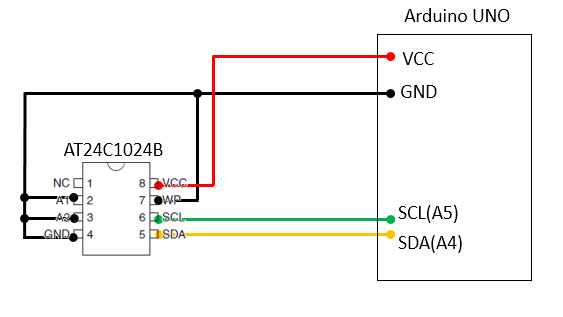
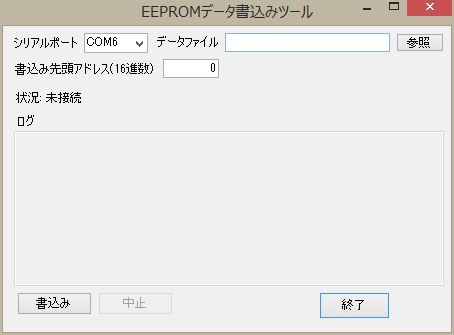
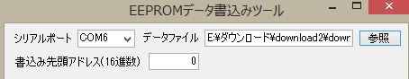
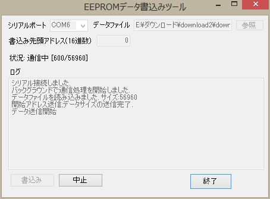
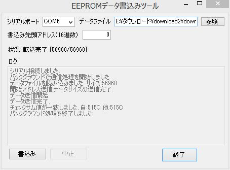
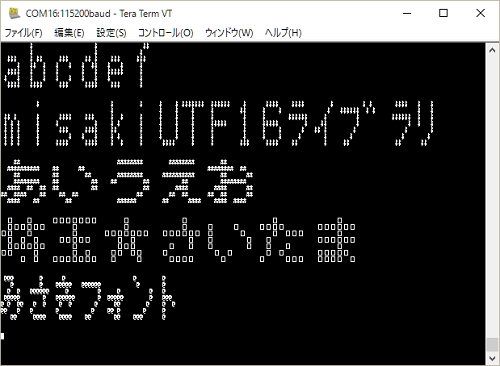

# Arduino-misakiUTF16Full
Arduino用 美咲フォントライブラリ I2C EEPROM乗せフルフォント版

##概要
Arduino用の美咲フォントドライバライブラリです。  
[Little Limit](http://www.geocities.jp/littlimi/index.html)さんが公開している[美咲フォント](http://www.geocities.jp/littlimi/misaki.htm)を利用しています。  
I2C接続EEPROM(AT24C1024B)にフォントを格納しています。  

ライブラリAPIより文字コードUTF16/UTF8に対応するフォントデータを取得して利用できます。  
機能は教育漢字版 フラッシュメモリ乗せ版とほぼ同じですが、ハードウエア的に漢字フォントを格納した  
EEPROM(AT24C1024B)が必要となります(漢字フォントデータの書き込みも必要)。  

##回路図  
  

EEPROMは現状、容量1MビットのAT24C1024にのみ対応しています。  

###フォントデータの書き込み
ディレクトリ toolsの下の フォントファイル**misaki_gothic.bin**をEEPROMに書き込んで利用して下さい。  

Windows環境であれば、ディレクトリ toolsの下のEEPROMWrite.exeを使って書き込みが行えます。  
あまり良い作りではなく、送信速度遅いです。書込み完了に８分かかります。  
EEPROMWrite.exeの実行には .NET Framework 3.5以上が必要です。  

EEPROMWrite.exeを使った書き込みにはArduinoが必要です。  
回路図の構成でArduinoを結線し、ディレクトリ tools下のスケッチ download2.ino を書き込んで下さい。  
EEPROMWrite.exe を実行すると次の画面が表示されます。  

   

Arduino Unoと接続可能なシリアルポートを選択し、[参照]ボタンで  
フォントデータ misaki_gothic.bin を指定します。  

   

[書込み]ボタンを押すと、書き込みが開始されます。
書き込みの進捗状況が画面に表示されます。

書込みが完了するまで８分くらいかかります。正常終了すると、  
次のような画面になります。  

   

中断する場合は、[中止]ボタンを押してください。  
正常終了すると、次のような画面になります。   

   

稀に、途中で止まってチェックサム処理まで行かない場合があります。  
その場合はArduino Unoをリセットし、ツールを再実行してやり直して下さい。  

##仕様
* 文字コード  UTF16/UTF-8  
* フォントサイズ  8x8ドッド（美咲フォント)  
* 利用可能フォント数  7,120字（EEPROMに格納）  
  * 全角漢字(非漢字含む) 6,962字
  * 半角フォント  158字(半角記号、半角英数、半角カタカナ）  
  
##利用可能API
*  フォント利用のための初期化  
  `void font_init()`
 * 引数  
 なし  
 * 戻り値  
 なし  
 I2C接続EEPROM利用のための初期化を行っています。   

* UTF8文字列をUTF16文字列に変換する  
`byte Utf8ToUtf16(uint16_t* pUTF16, char *pUTF8)`  
 * 引数  
 `pUTF16`: UTF16文字列格納アドレス(OUT)  
 `pUTF8`: UTF8文字列格納アドレス(IN)  
 * 戻り値  
 変換したUTF16文字列の長さ(変換失敗時は-1を返す)  

* UTF8文字(1～3バイト)をUTF16(2バイト)に変換する  
  `byte charUFT8toUTF16(char *pUTF8, uint16_t *pUTF16)`
 * 引数  
 `pUTF16`: UTF16文字格納アドレス(OUT)  
 `pUTF8`: UTF8文字格納アドレス(IN)  
 * 戻り値  
 変換処理したUTF8文字のバイト数(0～3、変換失敗時は0を返す)  

* UTF16半角コード(記号英数字、カナ)をUTF16全角コードに変換する  
  `uint16_t utf16_HantoZen(uint16_t utf16)`  
 * 引数  
 `utf16`: UTF16文字コード(IN)  
 * 戻り値  
 変換処理したUTF16文字コード(指定したコードが全角の場合はそのままコードを返す)  

* 半角カナを全角に変換  
  `uint16_t hkana2kana(uint16_t ucode)`  
 * 引数  
 `ucode`: UTF16文字コード(IN)  
 * 戻り値  
 変換処理したUTF16文字コード(指定したコードが全角の場合はそのままコードを返す)  

* UTF16に対応するフォントデータ(8バイト)取得  
  `boolean getFontDataByUTF16(byte* fontdata, uint16_t utf16)`    
 * 引数  
 `fontdata`: フォントデータ格納アドレス(OUT)  
 `utf16`: UTF16文字コード(IN)  
 * 戻り値  
 true: 正常終了 false: 異常終了  

* UTF8文字列に対応する先頭文字のフォントデータ取得  
  `char* getFontData(byte* fontdata,char *pUTF8,bool h2z=false)`  
 * 引数  
 `fontdata`: フォントデータ格納アドレス(OUT)  
 `pUTF8`: UTF8文字列(IN)  
 * 戻り値  
 変換を行った文字の次位置のアドレスを返す(文列末は0x00を指す位置となる).    
 取得失敗時はNULLを返す.  

* 利用可能フォントの検索    
`int findcode(uint16_t  ucode)`  
 * 引数  
 `ucode`: UTF16文字コード(IN)  
 * 戻り値  
 指定したコードに対するフォントコードを返す.   
 該当するフォントが存在ししない場合は-1 を返す.  

##サンプルスケッチ
banner  

